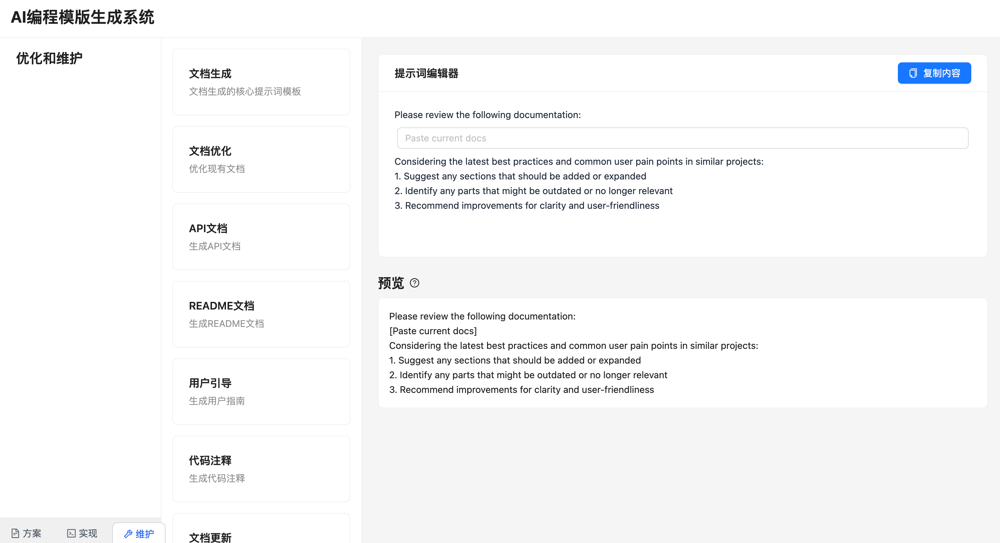

# AI Programming Template Generation System

This project is entirely generated by an AI assistant, designed to help developers quickly generate high-quality technical documentation and development guides.

## Preview



## Key Features

- 🎯 **Phase-Based Prompt Generation**: Project divided into planning, implementation, and maintenance phases, each with specialized prompt templates
- 📝 **Interactive Editing**: Support for filling in specific content in prompt templates with real-time preview
- 🎨 **Elegant User Interface**:
  - Timeline-style node navigation
  - Dynamic highlight effects
  - Responsive layout design
- 💾 **Temporary Storage**: Maintains input content until page refresh
- 👁️ **Real-time Preview**: Instant view of generated content

## Tech Stack

- 🚀 Next.js 14
- ⚛️ React 18
- 🎨 Ant Design v5
- 🌈 TailwindCSS
- 📦 Zustand State Management

## Core Features

### 1. Phase-Based Project Management
- Planning Phase: Project planning and architecture design
- Implementation Phase: Specific code implementation guidelines
- Maintenance Phase: Optimization and maintenance suggestions

### 2. Smart Prompt Templates
- Core Prompts: Main prompt templates for each node
- Assistant Prompts: Supplementary specialized prompts
- Variable Support: Uses `[variable_name]` syntax for prompt customization

### 3. Interactive Features
- Multi-level node navigation
- Real-time content preview
- One-click copy functionality
- Content temporary storage

## Project Structure

```
src/
├── components/
│   ├── layout/          # Layout components
│   ├── project-nodes/   # Project node components
│   ├── prompt-editor/   # Prompt editor
│   └── prompt-selector/ # Prompt selector
├── stores/
│   └── useStore.ts      # Global state management
└── types/
    └── store.ts         # Type definitions
```

## Implementation Details

### Visual Design
- Timeline display for project nodes
- Blue theme interaction feedback
- Card-based content display
- Smooth animation transitions

### State Management
- Zustand for global state management
- Support for node switching and content caching
- Multi-level state synchronization

### User Experience
- Real-time input feedback
- Clear visual guidance
- Intuitive operation flow

## Project Highlights

1. **Elegant Interaction Design**
   - Timeline navigation provides clear project progress view
   - Dynamic highlighting enhances user experience
   - Smooth animation transitions improve interface fluidity

2. **Intelligent Content Management**
   - Templated prompt system
   - Real-time content preview
   - Session-level data persistence

3. **Professional Development Standards**
   - TypeScript type safety
   - Component-based development
   - Responsive design

## Developer

This project is completely generated by an AI assistant, demonstrating AI capabilities in modern web development, including:
- Architecture design
- Component implementation
- State management
- Style development
- Type definitions
- Documentation writing

## Template Source

> **Important**: All prompt templates in this project are inspired by and adapted from [AI-Assisted Software Development: A Comprehensive Guide with Practical Prompts](https://aalapdavjekar.medium.com/ai-assisted-software-development-a-comprehensive-guide-with-practical-prompts-part-1-3-989a529908e0) by Aalap Davjekar. We express our gratitude for the comprehensive guide that formed the foundation of our prompt system.

The templates cover various aspects of software development:
- Project initialization and planning
- Design and architecture decisions
- Implementation guidelines
- Optimization strategies
- Maintenance procedures

## Usage Instructions

1. Install dependencies:
```bash
npm install
```

2. Start development server:
```bash
npm run dev
```

3. Build production version:
```bash
npm run build
```

## Important Notes

- This project uses session storage, content will be cleared on page refresh
- It's recommended to browse the complete node list before use
- Templates can be freely switched between different phases as needed

---

> This project is entirely generated by an AI assistant, showcasing AI capabilities in frontend development. If you find this project helpful, feel free to Star and Fork.
